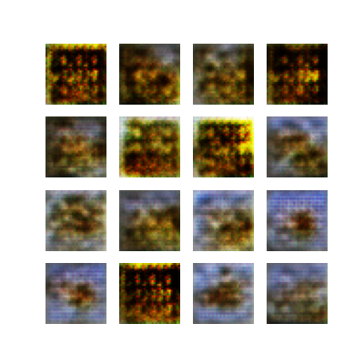
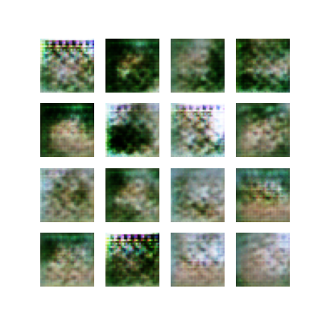
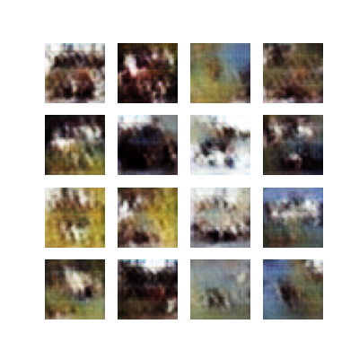

# generative-adversarial-networks

## Overview

This project implements and experiments with a **Deep Convolutional Generative Adversarial Network (DCGAN)** using TensorFlow and Keras.  
The original starter GAN code (designed for MNIST) was extended and modified to:

- Use the **CIFAR-10 dataset**
- Support **32×32 RGB images**
- Add **additional convolutional layers** to the generator
- Save generated images **every 10 epochs** to visualize training progress

The goal of this is to understand adversarial training, GAN stability, and how architectural changes affect image quality.

---

## Training Progress (Saved Samples)

The following images show samples generated by the model at different stages of training.

### Epoch 10

### Epoch 20

### Epoch 30

### Epoch 40

### Epoch 50

---

## Observations

- Early epochs show noisy and unstructured images
- As training progresses, shapes and colors become more coherent
- Some artifacts remain, reflecting common GAN training challenges such as instability and partial mode collapse

---

## Conclusion

This project demonstrates how modifying GAN architectures and datasets affects training dynamics and output quality. 
